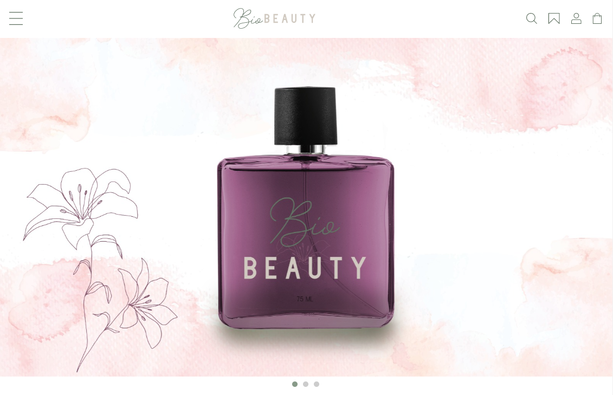
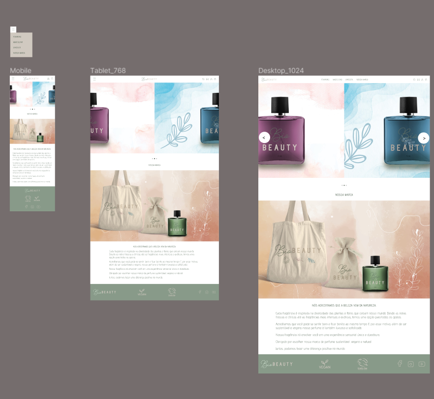

# BioBEAUTY

> Criação de uma landing page de um ecommerce para venda de perfume.  
> Este projeto faz parte de um desafio, proposto pelos mentores do programa Desenvolve do Grupo Boticário, que precisava ter :
- Header
- Apresentação da marca
- Menu (com itens hipotéticos)
- Footer

 

## Figma
> Também era necessário criar o layout do projeto no Figma  

⚠️ O projeto deveria ser responsivo para celulares, tablet e desktop.  

- [Link para o projeto no Figma](https://bitlybr.com/IzOps)  
- [Link para a página](https://veronicaparanhos.github.io/biobeauty/)
