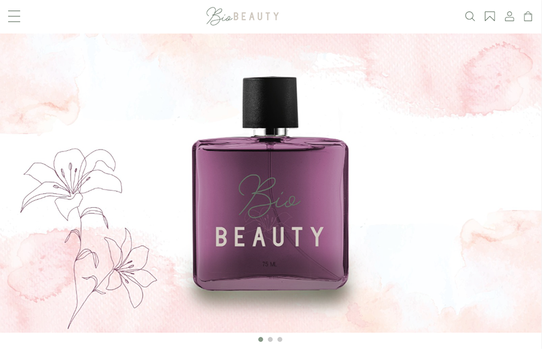

# BioBEAUTY

> Landing page de um ecommerce para venda de perfume.  
> Desafio proposto pelos mentores do programa Desenvolve do Grupo Boticário, que precisava ter :
- Header
- Apresentação da marca
- Menu (com itens hipotéticos)
- Footer

 
> ⚠️ O projeto deveria ser responsivo para celulares, tablet e desktop.

## Figma
> Também era necessário criar o layout no Figma
Link para o projeto no Figma: https://bitlybr.com/IzOps
Link para a página: https://veronicaparanhos.github.io/biobeauty/
